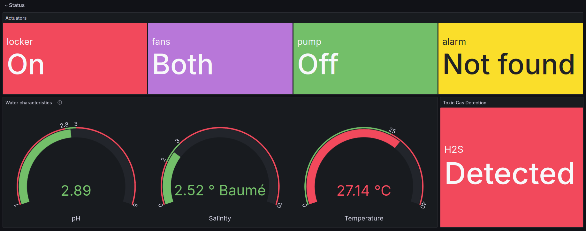
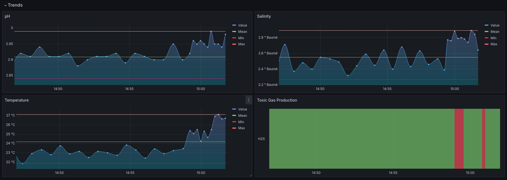

# LeatherSense

## Overview

**LeatherSense** is an IoT-based monitoring and control system designed to optimize the pickling phase of the leather tanning process. The system monitors key environmental parameters such as pH, salinity, temperature, and hydrogen sulfide (H2S) levels to ensure high product quality, operational efficiency, and worker safety.

Here an example of a system display while it is running (using Grafana):



More information about the project can be found in the [project report](documentation/Documentation.pdf).

## Features

- **Real-time Monitoring**: Continuous tracking of critical water characteristics (pH, salinity, temperature) and toxic gas levels (H2S).
- **Automated Control**: Intelligent actuators adjust environmental conditions based on sensor data to maintain optimal processing conditions.
- **Safety Alerts**: Automatic activation of safety protocols, including ventilation and drum locking, when hazardous gas levels are detected.
- **Data Visualization**: Historical and real-time data visualization through Grafana, providing actionable insights and trend analysis.
- **Remote Control**: A command-line interface for configuring parameters, starting/stopping the pickling process, and monitoring system status.

## Architecture

The system is based on the **Contiki-NG** operating system, with sensors and actuators managed via nRF52840 dongles. The architecture includes:

- **MQTT Network**: Handles sensor data collection and transmission.
- **CoAP Network**: Manages actuator control and resource exposure.
- **Backend System**: Processes sensor data, controls actuators, and interfaces with a MySQL database and Grafana for data storage and visualization.
- **RPL Border Router**: Deployed on a nRF52840 dongle to manage communication within the IoT network.

## Getting Started

### Prerequisites

- **Hardware**: nRF52840 dongles, sensors (pH, salinity, temperature, H2S), actuators (air fans, water pumps, alarms, lockers).
- **Software**: Contiki-NG, Python, Mosquitto (MQTT broker), Grafana, CoAP library (e.g., `aiocoap` for Python), MySQL.

### Installation

1. **Clone the Repository**:
   ```bash
   git clone https://github.com/LeBonWskii/IOT-Project.git
   cd IOT-Project
   ```

2. **Move Repository to Contiki-NG Examples**:
   - Since the project relies on Contiki-NG dependencies, it should be placed within the `contiki-ng/examples` directory:
   ```bash
   mv IOT-Project /path/to/contiki-ng/examples/
   cd /path/to/contiki-ng/examples/IOT-Project
   ```

3. **Compile and Flash Code to nRF52840 Dongles**:
   - **Compile and Flash the Code**:
     - Ensure your dongles are connected and correctly recognized by your system. To compile and flash the code on the dongle:
     ```bash
     make TARGET=nrf52840 BOARD=dongle <program-name>.dfu-upload PORT=/dev/ttyACMx
     ```
     - Replace `<program-name>` with the specific program you are compiling (**sensors, actuators and border router codes**). The `PORT` should be set according to the dongle's connection, where `x` corresponds to the number of the connected dongle (e.g., `ACM0` for the first dongle, `ACM1` for the second, etc.).
     - **Note**: Running the command without the `.dfu-upload` part will only compile the code:
     ```bash
     make TARGET=nrf52840 BOARD=dongle <program-name>
     ```

   - **Connect to the Dongle Output**:
     - After flashing, you can connect to the port to get the output of the dongle using:
     ```bash
     make login TARGET=nrf52840 BOARD=dongle PORT=/dev/ttyACMx
     ```

   - **Simplify Commands with `savetarget`**:
     - To avoid specifying the `TARGET` and `BOARD` flags each time, you can save them:
     ```bash
     make savetarget TARGET=nrf52840 BOARD=dongle
     ```
     - This will create a `Makefile.target` file in the directory, making subsequent commands simpler.

4. **Run the System**:
   - Use the provided `run.sh` script to automate the setup and launch of the system:
   ```bash
   ./run.sh [cooja|dongle|help]
   ```
   - **Arguments**:
     - `cooja`: Starts the Cooja simulator and the border router.
     - `dongle`: Starts the border router with the dongle.
     - `help`: Displays the usage instructions for the script.

### Usage
In the CLI interface:
- **Start the Pickling Process**:
   ```bash
   start pickling
   ```
- **Stop the Pickling Process**:
   ```bash
   stop pickling
   ```
- **Monitor System Status**:
   ```bash
   monitor
   ```
- **Configure Parameters**:
   ```bash
   configure
   ```
